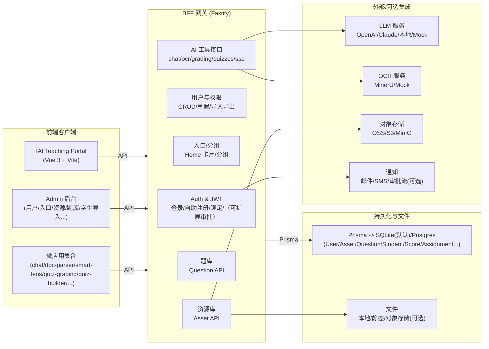

# 平台统一架构与微应用/内容中台规范（整合版）

> 本文档整合并统一了以下三份文档的关键信息（并结合当前仓库落地情况做了“口径对齐”）：
> - `docs/Architecture_Overview.md`（整体架构概览）
> - `docs/Architecture_MicroApps_Whitepaper.md`（微应用架构白皮书）
> - `docs/06_Content_Library_and_QBank.md`（资源库/题库设计草案）
>
> 核心目标：回答“**新微应用如何接入用户体系，并共享资源库/题库数据**”，同时明确本项目的“核心中的核心”——**学生学习数据采集**与**教师资源资产化沉淀**。

---

## 0. 读者与范围

**读者**
- 产品/架构评审：理解平台边界、演进路线与关键风险点。
- 前端/微应用开发：知道怎么新增应用、如何复用登录态、如何沉淀内容。
- 后端开发：知道 BFF 的职责、路由/服务拆分、数据建模与权限校验。
- 运维：知道推荐的部署形态与配置点。

**本文覆盖**
- 平台整体分层与运行拓扑（Portal/Micro-Apps/BFF/DB/外部能力）。
- 微应用接入规范（独立开发、集成运行、外链部署）。
- “内容中台”：资源库（Asset）与题库（Question）的模型、API 与沉淀流程。
- “学习数据中台”：围绕学生学习过程/测评闭环的统一采集口径与扩展建议。
- 权限/租户/审计的统一约定。

---

## 1. 总体架构（Runtime View）

平台采用 **Monorepo + Portal 宿主 + 微应用 + BFF** 的组合：
- **Portal（教师端）**：统一入口、导航、管理后台与内嵌微应用路由。
- **Micro-Apps**：面向具体场景的功能模块（OCR、教案、组卷、阅卷等）。
- **BFF（Fastify）**：统一鉴权、聚合与业务 API，作为唯一可信的数据入口。
- **DB（Prisma）**：单库多模块（默认 SQLite，可切换 Postgres）。
- **External**：LLM/OCR/对象存储/通知等可插拔能力。



---

## 2. 仓库结构与模块边界（Code View）

Monorepo 工作区由 `pnpm-workspace.yaml` 定义：

```text
root/
├── apps/                  # 微应用集合（多数是 Vue + Vite）
├── iai-teaching-portal/   # Portal 宿主（含 Admin 管理后台与内嵌路由）
├── bff/                   # BFF（Fastify + Prisma）
└── docs/                  # 设计文档与规范
```

**入口与启动**
- 开发一键启动：`start_dev.sh`（Portal/BFF/部分微应用独立端口）。
- 生产模拟：`start_prod.sh`（构建 + preview）。

**关键代码索引（以仓库现状为准）**
- Portal 路由（内嵌微应用）：`iai-teaching-portal/src/router/index.ts`
- Portal 入口配置加载：`iai-teaching-portal/src/utils/config.ts`
- BFF 主入口与路由注册：`bff/src/main.ts`
- 鉴权插件：`bff/src/plugins/auth.ts`
- Prisma 模型：`bff/prisma/schema.prisma`

---

## 3. 微应用体系（Micro-Apps）

### 3.1 定义与边界

微应用被视为“可插拔的功能模块”，具备独立迭代能力，但**共享统一的用户体系与数据中台**。

**强约束（保证可运营与可扩展）**
- 微应用 **不直连数据库**，不绕过权限逻辑；只能通过 BFF API 访问数据。
- 任何高价值产出（教案、解析、试题、讲评、素材）应沉淀为平台“资产”（Asset），形成可复用内容。

### 3.2 运行/部署模式（从轻到重）

1) **集成模式（推荐默认）**
- 微应用作为 Portal 路由的一部分运行（同域同源），可天然复用登录态与 `/api` 代理。
- 仓库现状：Portal 路由直接 `import` `apps/*/src/...`（见 `iai-teaching-portal/src/router/index.ts`）。

2) **独立开发模式（开发期常用）**
- 微应用单独跑 Vite dev server（独立端口）。
- 推荐配置 `/api` 代理到 BFF（示例：`apps/student-stats/vite.config.ts`）。

3) **外链/独立部署（重型应用常见）**
- 适合阅卷系统、数据看板等体积/团队更大的模块。
- 关键是“**登录态共享**”：推荐通过统一域名/反向代理挂载到同源路径，或升级到 SSO（OIDC）。

### 3.3 UI App Shell 规范（统一体验）

建议微应用遵循统一壳层：
- `Header`：固定高度 `h-16`，左侧返回/标题/简介，右侧操作区（历史/设置/导出等）。
- `Main`：`p-4` 或 `p-6`，`max-w` 居中，背景 `bg-slate-50`。

（该部分源自白皮书，可作为 UI 评审的最小约束。）

### 3.4 在 Portal 中注册一个新应用

一个新应用“进入系统”至少需要两件事：
1) **路由接入（集成模式）**：在 `iai-teaching-portal/src/router/index.ts` 增加 `path: /apps/<code>` 指向微应用组件。
2) **入口接入（导航/卡片）**：在“入口管理”里新增 Entry（分组、名称、URL、状态、标签等）。

入口配置来源顺序（仓库现状）：
- 优先：`GET /api/entries/config`（从 DB 读取分组与入口，`bff/src/routes/entries.ts`）
- 失败回退：本地 `portalConfig`（`iai-teaching-portal/src/utils/config.ts`）

> 这意味着：即便后端没启动，Portal 仍能用本地配置展示入口；后端启动后则可用 Admin 动态配置入口。

### 3.5 后端接口命名与服务拆分

推荐 API 命名空间遵循：
- **业务域前缀**：`/api/<domain>/...`（如：`/api/ocr/*`、`/api/grading/*`）
- **中台能力**：`/api/assets`（资源库）、`/api/questions`（题库）等通用域

服务层建议按域拆分到 `bff/src/services/*`，避免跨模块直接写对方表（公共能力走 utils/core service）。

---

## 4. 统一鉴权与用户上下文（微应用共享用户的关键）

### 4.1 原则：BFF 是唯一可信入口

无论微应用如何部署，用户身份与权限判断必须由 BFF 统一完成：
- 登录发放 token / session
- `/api/*` 统一校验
- DB 访问只发生在 BFF（Prisma）

### 4.2 当前仓库实现（JWT）

已实现的核心能力：
- 登录换 token：`POST /api/auth/login`（`bff/src/routes/auth.ts`）
- 当前用户：`GET /api/whoami`（`bff/src/routes/secure.ts`）
- BFF 统一校验：`app.authenticate`（`bff/src/plugins/auth.ts`）

微应用如何拿“当前用户”：
- 带上 `Authorization: Bearer <token>` 调用 `/api/whoami`，BFF 返回 `id/username/name/role`。
- 在集成模式（同域）下，可复用 Portal 的 `useAuth`（`iai-teaching-portal/src/composables/useAuth.ts`）。

### 4.3 推荐的生产形态（避免多端口/多域引发的免登问题）

如果未来出现“独立部署的大应用”（例如阅卷）：
- **推荐**：通过反向代理把应用挂到同一域名下的 `/apps/<code>`，让 Cookie/JWT 同源生效。
- **可选**：引入 SSO（OIDC/JWKS），统一由 IdP 发 token，BFF 做验证。

> 不推荐长期把 token 通过 URL 参数传递（易泄露/难控制）；若必须用，应使用短期一次性票据并限制来源域名。

### 4.4 多租户（Tenant）口径

仓库内存在 `x-tenant-id` 的读取工具（`bff/src/utils/tenant.ts`），但部分路由仍硬编码 `default`。

统一建议：
- tenantId 应进入 token（或服务端 session），由 BFF 派生“当前租户”。
- 不要完全信任前端透传的 `x-tenant-id`（避免伪造越权）。

---

## 5. 内容中台：资源库（Asset Library）

资源库的定位：**跨微应用共享的内容沉淀层**（工具产生内容，资产沉淀后可被其它工具检索/复用/二次加工）。

### 5.1 Asset 标准结构（建议口径）

平台以 `Asset` 作为统一“内容资产”：
- `title`：标题
- `type`：资源类型（如 `markdown`、`file`、`image`、`quiz-json`、`courseware` 等）
- `content`：结构化/文本内容（Markdown/JSON 等）
- `contentUrl`：附件 URL（PDF/图片/ZIP 等，支持对象存储）
- `metadata`：JSON（如 `mime/size/subject/grade/version/status` 等）
- `tags`：JSON 数组（统一推荐存 JSON 字符串，便于跨端处理）
- `toolId`：来源工具（可选，关联 `Tool`）
- `visibility`：`PRIVATE|INTERNAL|PUBLIC`
- `authorId`：作者/创建者
- `deletedAt`：软删除

> 说明：当前 schema 中 `tags/metadata` 为 String 字段，实践中以 JSON 字符串存储（便于兼容 SQLite/Postgres）。

### 5.2 API 约定（推荐统一走 `/api/assets`）

建议把资源库统一收敛为 `/api/assets`（仓库已实现，含权限过滤/审计等）：
- `GET /api/assets`：列表（可按 `type/visibility/toolId` 过滤）
- `POST /api/assets`：创建（内容或 URL 至少一项）
- `GET /api/assets/:id`：详情（按角色与可见性判断）
- `DELETE /api/assets/:id`：软删除
- `POST /api/assets/:id/restore`：恢复

部分业务域也可提供“快捷沉淀”接口（例如 OCR：`POST /api/ocr/tasks/:id/save-asset`），但最终仍应落到 `Asset` 表。

### 5.3 微应用内容沉淀标准流程（推荐）

1) 用户在微应用中完成生成/解析/编辑。
2) 点击“存入资源库”（统一对话框：标题/标签/可见性）。
3) 微应用调用 `POST /api/assets`（或业务 `save-asset`）写入资产。
4) 资产出现在 Portal 的资源库管理/检索中，供后续复用。

---

## 6. 内容中台：题库（Question Bank）

题库定位：**结构化题目资产**，服务于组卷、阅卷、练习等场景。

### 6.1 Question 结构与状态（以 schema 为准）

`Question` 关键字段：
- `stem`、`type`（`single|multi|fill|short|essay`）
- `options/answer/analysis`（JSON/Markdown）
- `subject/grade/difficulty/knowledgePoints/attachments`
- `status`：`DRAFT|PUBLISHED|ARCHIVED`
- `version`、`createdBy/updatedBy`、时间戳

### 6.2 API 约定（仓库已实现）

题库 API（均需鉴权）：
- `GET /api/questions`：列表与筛选
- `POST /api/questions`：创建（教师/管理员）
- `GET /api/questions/:id`：详情（未发布仅作者/管理员可见）
- `PUT /api/questions/:id`：更新（未发布：作者可改；发布/归档需管理员策略）
- `POST /api/questions/:id/publish`：发布（管理员）
- `DELETE /api/questions/:id`：归档（管理员）
- `GET /api/questions/export`：导出（管理员）

### 6.3 题库与资源库的关系（建议）

两种常见组合方式：
- 题目中 `attachments` 引用资源库的 `contentUrl`（或外部 URL）。
- 将“题目/题组导出结果”（JSON/Word/PDF）作为 Asset 存入资源库，形成可复用教材/试卷资产。

---

## 7. 核心数据基座：学生学习数据 × 教师资源资产（项目核心）

本项目的长期价值不在“应用数量”，而在**统一沉淀的数据资产**：
- **学生学习数据**：不仅是“成绩结果”，还包括学习过程与测评全链路（作业布置→提交→批改→反馈→导出/追踪）。
- **教师资源资产**：把微应用产出的高价值内容沉淀到资源库，形成可检索、可复用、可二次加工的“内容中台”。

微应用在这里的定位非常明确：**数据的生产者/消费者**。

### 7.1 现有数据基础（仓库现状）

以 `bff/prisma/schema.prisma` 为准，当前已具备两条主线的雏形：
- **学情/测评闭环**：`Student`、`Exam`、`Score`、`Assignment`、`Submission`、`GradingResult`（以及导出/统计路由：`bff/src/routes/academic/*`、`bff/src/routes/grading.ts`）。
- **内容资产与题库**：`Asset`、`Question`（以及资源库/题库路由：`bff/src/routes/assets.ts`、`bff/src/routes/questions.ts`）。

### 7.2 学生学习数据：建议补齐“过程数据采集层”

仅有 `Score/Submission` 还不够支撑“学习过程洞察”。建议新增一层跨微应用的过程数据模型（示例命名：`LearningEvent`/`EventLog`）：
- **谁**：`actorId`（老师/学生/系统），以及可选的 `studentId`（事件关联学生）。
- **何时**：`occurredAt`（事件时间）+ `createdAt`（入库时间）。
- **在哪里/由谁产生**：`toolId`/`appCode`（来源微应用）。
- **做了什么**：`eventType`（枚举/约定，如 `asset.viewed`、`assignment.created`、`submission.created`、`grading.completed`）。
- **作用在什么对象上**：`targetType` + `targetId`（如 Asset/Question/Assignment/Submission）。
- **附加信息**：`payload`（JSON），用于保存事件特有字段（耗时、结果摘要、题目数、分值等）。

同时提供统一上报接口（建议支持批量，减少前端请求数）：
- `POST /api/events`（或 `/api/learning/events`）：BFF 鉴权后落库；微应用只负责上报，不做统计口径。

> 这层能力的价值：让后续的数据产品（学情洞察、资源推荐、使用画像、教学闭环追踪）不再依赖“某个微应用是否单独埋点”，而是平台级一致采集。

### 7.3 教师资源资产：统一收敛到 Asset（避免多套口径）

资源资产化的关键是“**一套 API + 一套存储口径 + 一套权限规则**”：
- 推荐以 `/api/assets` 作为资源库唯一入口（仓库已实现：`bff/src/routes/assets.ts`），微应用的“存入资源库”统一调用它（或业务域的 `save-asset` 最终落 Asset）。
- 元数据建议统一走 `metadata/tags`（JSON 字符串），并明确 `visibility`、`toolId`、`authorId` 的权限语义。

> 现状提醒：仓库中存在 `/api/resources` 与 `/api/assets` 两套路由与不同的 tags 序列化方式；若要让“所有微应用共享同一资源库”，建议尽快收敛到单一口径（否则检索/权限/沉淀会长期分裂）。

### 7.4 推荐落地顺序（最短闭环）

1) **统一资源库口径**：明确以 `/api/assets` 为唯一资源库 API，Portal 与微应用统一接入。
2) **补齐事件采集层**：定义最小事件字典 + `LearningEvent` 表 + `POST /api/events`（先覆盖：资源浏览/保存、作业创建/提交、批改完成、导出）。
3) **做出第一个“数据闭环产品”**：例如“学生作业批改→成绩导出→学情看板”，或“资源使用/收藏/复用推荐”。
4) **数据规模上来后切 Postgres**：SQLite 适合 demo；当多教师并发/批量任务/事件量上来，尽早迁移 Postgres。

---

## 8. 权限、审核与审计（统一口径）

### 8.1 角色建议

仓库现状角色：`ADMIN | TEACHER | VIEWER`（schema 注释）。
- `ADMIN`：全量管理、发布、审核、用户与配置。
- `TEACHER`：创建/编辑自己内容；可读 PUBLIC/INTERNAL 内容。
- `VIEWER`：只读（可按业务进一步限制）。

如需更细的运营角色，可引入 `EDITOR`（介于 TEACHER 与 ADMIN 之间），但建议先以现状角色跑通闭环。

### 8.2 审核流（可选）

资源/题目默认 `DRAFT`，管理员审核后 `PUBLISHED`；归档为 `ARCHIVED`。

### 8.3 审计

所有写操作（创建/更新/删除/恢复/发布/导入导出）建议写入 `AuditLog`，便于追责与运营统计。

---

## 9. 新应用接入指南（“怎么接触到用户与数据库数据”）

### 9.1 统一答案：只通过 BFF

微应用不会“直接接触 DB”；它接触的是：
1) **用户上下文**：`GET /api/whoami`
2) **内容中台**：`/api/assets`、`/api/questions` 等
3) **业务域接口**：`/api/<domain>/*`（OCR、阅卷、组卷等）

### 9.2 接入形态选择（建议决策树）

- 只是一个轻量工具/页面：优先 **集成模式**（Portal 路由内嵌）。
- 需要独立团队/独立发布/更重交互：可独立部署，但尽量挂同域路径（避免免登复杂度）。
- 需要异步任务/大文件/复杂流程（阅卷/批量处理）：前端仍可做微应用，后端建议拆 `worker + queue + storage`，BFF 仍作为统一入口。

### 9.3 新建微应用 Checklist（最小可用）

1) `apps/<app-code>/` 创建应用（Vue + Vite）。
2) 统一 `/api` 访问方式（同域或 dev proxy）。
3) 登录态：
   - 集成模式：复用 Portal 的 token（或后续 Cookie）。
   - 独立部署：走同域挂载或 SSO。
4) 数据接入：
   - 读取用户：`/api/whoami`
   - 读写资源库：`/api/assets`
   - 读写题库：`/api/questions`
5) 产出沉淀：提供“存入资源库”按钮，写入 Asset。
6) 注册入口：
   - Admin 后台入口管理（DB 驱动），或导入脚本同步配置。

---

## 10. 未来演进（保持可扩展）

当微应用规模增大，演进优先级建议：
1) **统一登录态**：同域 Cookie 会话 / OIDC（先解决“独立部署免登”）。
2) **重型应用后端拆分**：阅卷等引入队列/worker；BFF 保持 API 网关。
3) **微前端（可选）**：Module Federation/远程加载，适用于真正独立部署且希望仍“像内嵌一样”体验的应用。

---

## 11. 附录：关键路径索引（便于快速定位）

- Portal 内嵌微应用路由：`iai-teaching-portal/src/router/index.ts`
- 入口配置 API：`bff/src/routes/entries.ts`
- Portal 入口配置加载与回退：`iai-teaching-portal/src/utils/config.ts`
- 登录与 whoami：`bff/src/routes/auth.ts`、`bff/src/routes/secure.ts`
- 资源库（推荐）：`bff/src/routes/assets.ts`
- 题库：`bff/src/routes/questions.ts`
- OCR（含 save-asset 示例）：`bff/src/routes/ocr.ts`
- Prisma：`bff/prisma/schema.prisma`
