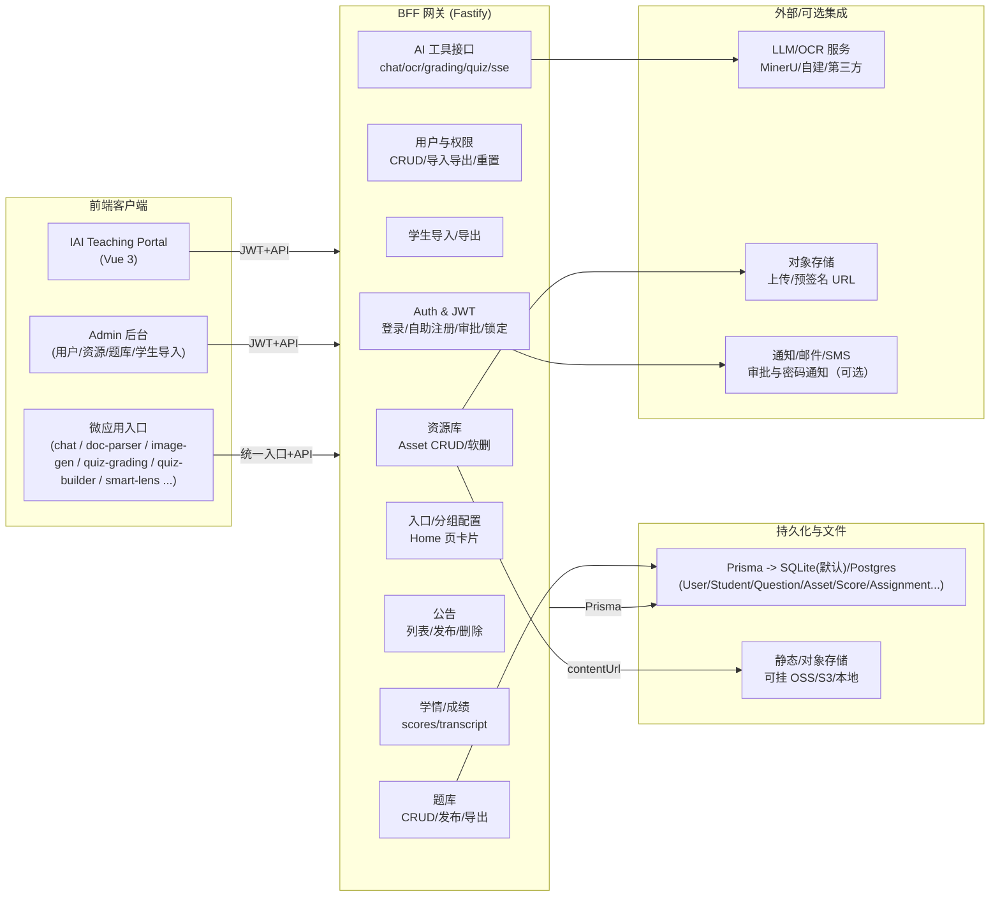

# 整体架构概览（SASU-Teacher-s-AI-Copilot-platform）

> ⚠️ 本文档已整合至 `docs/07_Platform_Architecture_MicroApps_Content.md`（统一架构与微应用/内容中台规范）。此处保留作为历史版本与补充材料。

> 以“教师端 AI 副驾驶”为目标，梳理前端、BFF、微应用、数据层与外部能力的整体关系，便于后续评审与交付。

## 文本框架图
- 前端：Portal（Vue 3）、Admin 后台、微应用集合（chat、doc-parser、image-gen 等）。
- BFF（Fastify）：鉴权/JWT、用户与权限、学生导入、资源库、题库、公告、入口/分组、学情成绩、AI 工具接口（chat/ocr/grading/quiz）、SSE。
- 数据层：Prisma → SQLite 默认（可切换 Postgres）；Asset/Question/Student/User/Score 等模型。
- 外部集成：LLM/OCR 服务（minerU/mock 可替换）、对象存储（OSS/S3）、通知渠道（审批/重置密码可扩展）、前端静态文件。

## Mermaid（可粘贴到支持 Mermaid 的文档/看板）

## 关键模块与代码索引
- 前端
  - Portal 路由与微应用接入：`iai-teaching-portal/src/router/index.ts`
  - Admin 导航：`iai-teaching-portal/src/views/admin/AdminLayout.vue`
  - 用户管理：`iai-teaching-portal/src/views/admin/UsersManage.vue`
  - 学生导入：`iai-teaching-portal/src/views/admin/StudentsImport.vue`
  - 资源库管理：`iai-teaching-portal/src/views/admin/ResourcesManage.vue`
  - 题库管理：`iai-teaching-portal/src/views/admin/QuestionsManage.vue`
  - 登录/自助注册：`iai-teaching-portal/src/views/LoginPage.vue` 与 `src/composables/useAuth.ts`
- 后端 BFF
  - 主入口与路由注册：`bff/src/main.ts`
  - 鉴权插件：`bff/src/plugins/auth.ts`
  - 用户/登录：`bff/src/routes/auth.ts`, `bff/src/routes/users.ts`
  - 学生导入导出：`bff/src/routes/students.ts`
  - 资源库：`bff/src/routes/resources.ts`
  - 题库：`bff/src/routes/questions.ts`
  - 入口/分组：`bff/src/routes/entries.ts`
  - 学情/成绩：`bff/src/routes/academic/*`
  - AI 工具：`bff/src/routes/chat.ts`, `ocr.ts`, `grading.ts`, `quizzes.ts`
  - Prisma 模型：`bff/prisma/schema.prisma`
- 数据与脚本
  - 重置管理员/种子：`bff/src/reset-admin.ts`, `bff/src/seed.ts`
  - 教师/学生导入脚本：`bff/src/scripts/importTeachers.ts`, `bff/src/scripts/importStudents.ts`

## 扩展与待办提示
- 租户隔离：当前 tenantId=default，可接入 `x-tenant-id` 头并做白名单校验。
- 上传与存储：若接 OSS/S3，需要预签名上传接口和回调校验；现有资源库支持 contentUrl 占位。
- 通知与审计：审批/密码重置可加邮件/SMS；写操作审计可落地 AuditLog 表。
- 权限：VIEWER 只读、TEACHER 编辑自己资源/题目、ADMIN 全量；如需更细粒度可用中间件按路由校验。
